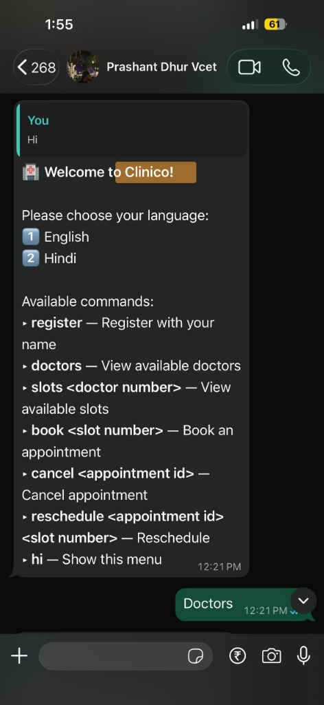
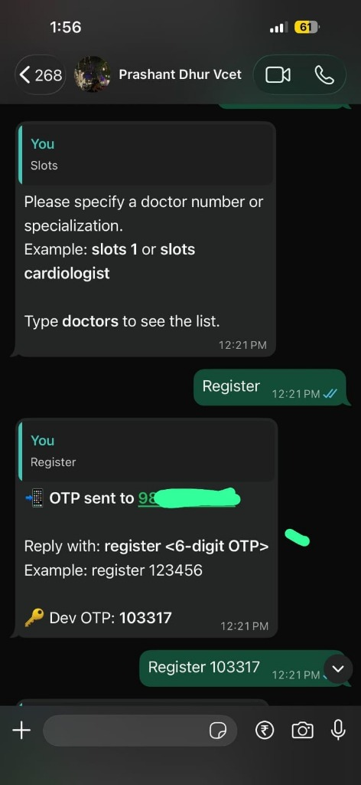
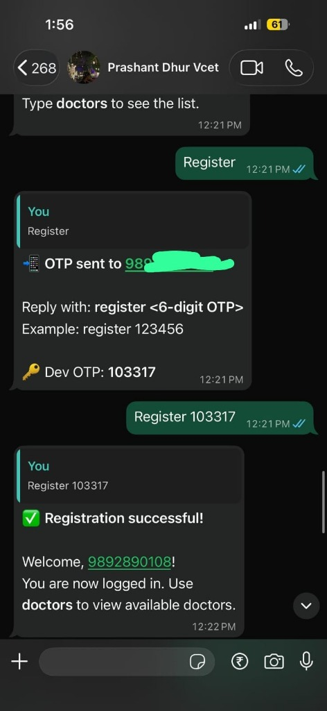
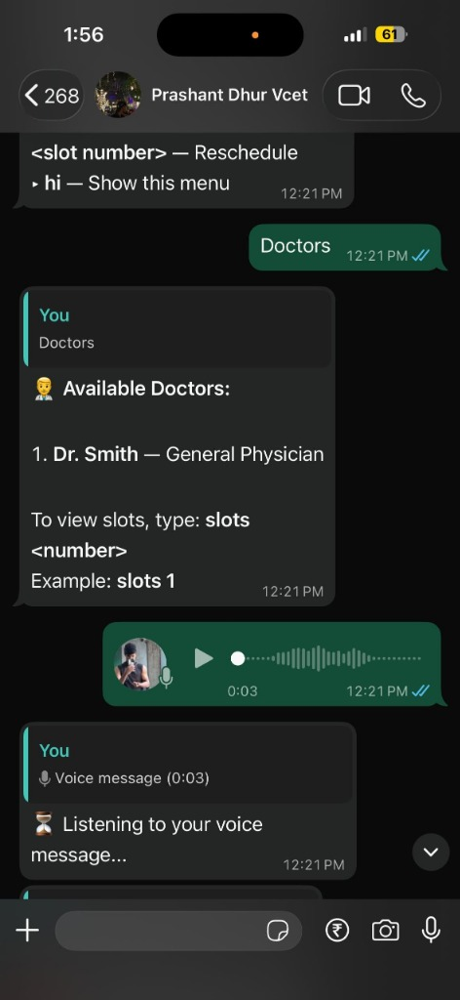

# 🏥 Clinico: WhatsApp-Based Appointment System

A multilingual, voice-enabled appointment automation platform for clinics and hospitals, featuring multi-channel support (**Web + WhatsApp**) and powered by a **Bun.js** runtime backend.

---

## 📌 Project Overview & Key Highlights

> **Tech Stack:** Bun.js | React | PostgreSQL | Redis | Baileys.js | Sarvam AI

- 📱 **In-App Receptionist WhatsApp Pairing:** Receptionists log into the web application, where a dynamic QR code renders directly on the Receptionist web interface. Once scanned, the system connects their WhatsApp number as the clinic's bot endpoint, automatically persisting the connection state in PostgreSQL.
- 💬 **Patient Messaging via Receptionist Number:** Patients simply message the registered Receptionist's WhatsApp number to book, reschedule, or check slot availability automatically via text or voice.
- 🌐 **Multilingual WhatsApp Automation:** Leverages Conversational AI tailored for Healthcare Tech to handle multi-patient scheduling and automated clinic workflows.
- 🎙️ **Conversational Voice Workflows:** Patients can send voice notes over WhatsApp, which are transcribed via Speech-to-Text pipelines and processed using **Sarvam AI** for effortless booking and inquiries.
- ⚡ **Bun.js Backend Engine:** High-performance REST API and scheduling backend built with Bun.js, TypeScript, and Prisma ORM.

---

## System Overview

**Clinico** is a comprehensive healthcare management system with three distinct user roles:
- **Patients** — Book appointments, view history, manage profile via Web or WhatsApp
- **Doctors** — Manage schedule, view appointments, update profile
- **Receptionists** — Scan QR to activate clinic WhatsApp bot, monitor all appointments, search/filter, and manage operations

### Architecture

```
┌─────────────────┐       ┌─────────────────┐
│  React Frontend │ ◄───► │  Bun.js Backend │
│  (Port 5173)    │       │  (Port 3001)    │
└─────────────────┘       └────────┬────────┘
                                   │
                          ┌────────┴────────┐
                          │   PostgreSQL    │
                          │    Database     │
                          └─────────────────┘
                                   ▲
                                   │
                          ┌────────┴────────┐
                          │ WhatsApp Bot    │
                          │  (Port 3002)    │
                          └─────────────────┘
```

---

## Features

### Core Features
- **Bun.js Powered REST API** — Fast runtime TypeScript backend using Bun.js & Prisma
- **Receptionist Web QR Pairing** — QR code displayed on Receptionist Web UI to connect clinic WhatsApp number; connection status synced to database
- **Patient WhatsApp Messaging** — Patients chat directly with the registered receptionist's WhatsApp number for instant automated booking
- **Phone-based OTP Authentication** — No passwords, JWT tokens delivered via WhatsApp
- **Role-based Access Control** — Dedicated Patient/Doctor/Receptionist roles
- **Multi-step Registration** — Detailed onboarding for patients & doctors
- **Real-time Dashboard** — Live appointment tables, KPI stats, and doctor schedules
- **Smart Appointment Booking** — Conflict detection, slot generator, rescheduling, cancellation
- **Voice Note Processing** — Speech-to-text voice note transcription via Sarvam AI

### Tech Stack

| Component | Technologies |
|-----------|-------------|
| **Backend Engine** | **Bun.js** + TypeScript + Prisma ORM |
| **Frontend** | React 19 + TypeScript + Vite |
| **Database** | PostgreSQL |
| **WhatsApp Bot** | Baileys.js / whatsapp-web.js |
| **Voice AI** | Sarvam AI (Speech-to-Text) |
| **Auth** | JWT + WhatsApp OTP |

---

## Quick Start

### Prerequisites
- [Bun](https://bun.sh) v1.0+
- [Node.js](https://nodejs.org) v20+ (for WhatsApp bot)
- [PostgreSQL](https://www.postgresql.org/) 14+

### 1. Backend Setup

```bash
cd backend
bun install
# Configure .env (see backend/README.md)
bunx prisma db push
bun run dev
```

Backend runs at `http://localhost:3001`

### 2. Frontend Setup

```bash
cd frontend
npm install
npm run dev
```

Frontend runs at `http://localhost:5173`

### 3. WhatsApp Bot (Optional)

```bash
cd whatsapp-channel
npm install
npm start
```

Scan QR code to link WhatsApp. Bot runs HTTP server at `http://localhost:3002`

---

## Project Structure

```
PKG_TechBlitz26/
├── backend/              # Bun + TypeScript REST API
│   ├── prisma/           # Database schema
│   ├── src/
│   │   ├── modules/      # Feature modules (auth, doctors, patients, etc.)
│   │   ├── middleware/   # Auth + RBAC middleware
│   │   └── server.ts     # Entry point
│   └── README.md
├── frontend/             # React 19 + Vite SPA
│   ├── src/
│   │   ├── api/          # API client modules
│   │   ├── components/   # Dashboards + Auth + Registration
│   │   └── App.tsx       # Role-based routing
│   └── README.md
├── whatsapp-channel/     # WhatsApp bot + HTTP server
│   ├── src/
│   │   ├── bot.ts        # WhatsApp client + HTTP server
│   │   └── commands/     # Bot command handlers
│   └── README.md
└── README.md             # This file
```

---

## User Roles & Dashboards

### Patient
- **Registration:** Name, Age, Gender, Blood Group, Address, Medical History
- **Dashboard:** Next appointment card, upcoming/past appointments, book/cancel/reschedule
- **Profile:** Edit personal and medical information

### Doctor
- **Registration:** Name, Specialization, Qualifications, Experience, Consultation Fee, Bio
- **Dashboard:** Today's schedule, appointment list, KPI stats, profile card
- **Profile:** Edit professional details and bio

### Receptionist
- **Registration:** Name & registered phone number
- **WhatsApp Pairing:** Logs into Web App -> Live WhatsApp QR code generates on web interface -> Receptionist scans QR code via WhatsApp app to link number -> System connects bot and updates connection status in PostgreSQL
- **Dashboard:** Monitor live appointments table, view WhatsApp bot connection status, search by doctor, filter by status, and manage schedules

---

## 🔄 Receptionist WhatsApp Pairing & Patient Messaging Workflow

### 1. Receptionist WhatsApp Linking
1. Receptionist logs into the Clinico web application using their registered phone number.
2. The web interface requests a WhatsApp pairing QR code from the Bun.js backend / WhatsApp service.
3. A dynamic QR code is rendered directly on the **Receptionist Web Dashboard**.
4. The receptionist scans the QR code using the WhatsApp app on their mobile phone.
5. The system pairs the account, activates the bot session on the receptionist's number, and updates the connection state in the **PostgreSQL database**.

### 2. Patient WhatsApp Messaging Flow
1. Patients send a text or voice message directly to the registered **Receptionist's WhatsApp Number**.
2. The WhatsApp Bot intercepts the message and routes it to the **Bun.js backend**.
3. Voice notes are sent to **Sarvam AI** for Speech-to-Text conversion and intent extraction.
4. The Bun.js scheduling engine checks slot availability, processes booking/cancellation/reschedule requests, and updates PostgreSQL.
5. Confirmation messages are automatically replied back to the patient on WhatsApp.

---

## 💬 WhatsApp Channel Sample Chat Flows & Screenshots

Below are real sample chat screenshots and text interactions captured directly from the Clinico WhatsApp bot interface:

<div align="center">

| Welcome & Command Menu | OTP Request | OTP Registration Verified | Doctor List & Voice Note Workflow |
|:---:|:---:|:---:|:---:|
|  |  |  |  |

</div>

---

### 1. 🏥 Welcome Menu (`hi`)

> **Patient:** `hi`  
> **Clinico Bot:**  
> 🏥 *Welcome to Clinico!*  
>  
> Please choose your language:  
> 1️⃣ English  
> 2️⃣ Hindi  
>  
> Available commands:  
> ▸ *register* — Register with your name  
> ▸ *doctors* — View available doctors  
> ▸ *slots <doctor number>* — View available slots  
> ▸ *book <slot number>* — Book an appointment  
> ▸ *cancel <appointment id>* — Cancel appointment  
> ▸ *reschedule <appointment id> <slot number>* — Reschedule  
> ▸ *hi* — Show this menu  

---

### 2. 📲 Patient Registration & OTP Auth (`register`)

> **Patient:** `register`  
> **Clinico Bot:**  
> 📲 *OTP sent to 9876543210*  
>  
> Reply with: *register <6-digit OTP>*  
> Example: `register 123456`  
>  
> **Patient:** `register 482910`  
> **Clinico Bot:**  
> ✅ *Registration successful!*  
>  
> Welcome, Rahul Sharma!  
> You are now logged in. Use *doctors* to view available doctors.  

---

### 3. 👨‍⚕️ Listing Doctors & Checking Slots (`doctors` & `slots`)

> **Patient:** `doctors`  
> **Clinico Bot:**  
> 👨‍⚕️ *Available Doctors:*  
>  
> 1. *Dr. Priya Patel* — Cardiology  
> 2. *Dr. Rajesh Kumar* — Orthopedics  
>  
> To view slots, type: *slots <number>*  
> Example: `slots 1`  
>  
> **Patient:** `slots 1`  
> **Clinico Bot:**  
> 📅 *Available slots for Dr. Priya Patel* (2026-08-17):  
>  
> 1. 🕐 10:00 AM — 10:30 AM  
> 2. 🕐 11:30 AM — 12:00 PM  
> 3. 🕐 03:00 PM — 03:30 PM  
>  
> To book, type: *book <slot number>*  
> Example: `book 2`  

---

### 4. 📅 Booking an Appointment (`book`)

> **Patient:** `book 1`  
> **Clinico Bot:**  
> ✅ *Appointment Confirmed!*  
>  
> 🆔 ID: `appt_8f3a91b`  
> 🕐 Time: 10:00 AM  
> 📋 Status: CONFIRMED  
>  
> To cancel: *cancel appt_8f3a91b*  
> To reschedule: *reschedule appt_8f3a91b <new slot>*  

---

### 5. 🔄 Rescheduling & Cancellation (`reschedule` & `cancel`)

> **Patient:** `slots 1`  
> **Clinico Bot:**  
> 📅 *Available slots for Dr. Priya Patel* (2026-08-17):  
> 1. 🕐 11:30 AM — 12:00 PM  
> 2. 🕐 03:00 PM — 03:30 PM  
>  
> **Patient:** `reschedule appt_8f3a91b 2`  
> **Clinico Bot:**  
> ✅ *Appointment Rescheduled!*  
>  
> 🆔 ID: `appt_8f3a91b`  
> 🕐 New Time: 03:00 PM  
> 📋 Status: RESCHEDULED  
>  
> **Patient:** `cancel appt_8f3a91b`  
> **Clinico Bot:**  
> ✅ *Appointment Cancelled*  
>  
> 🆔 ID: `appt_8f3a91b`  
> 📋 Status: CANCELLED  

---

### 🎙️ 6. Multilingual Voice Note Booking (Powered by Sarvam AI)

> **Patient:** 🎙️ *(Sends Voice Note in Hindi: "Dr. Priya Patel ke paas aaj 3 baje ka slot book kar do")*  
> **Clinico Bot:**  
> 🗣️ *Voice Transcribed (Sarvam AI):* "Book slot at 3 PM today with Dr. Priya Patel"  
>  
> ✅ *Appointment Confirmed!*  
> 🆔 ID: `appt_992b41c`  
> 🕐 Time: 03:00 PM  
> 📋 Status: CONFIRMED  

---

## API Documentation

See **[backend/README.md](backend/README.md)** for complete API reference (powered by Bun.js).

**Key Endpoints:**
- `POST /auth/request-otp` — Request OTP (delivered via WhatsApp)
- `POST /auth/verify-otp` — Verify OTP, receive JWT
- `GET /doctors` — List all doctors
- `POST /appointments/book` — Book appointment with conflict detection
- `GET /dashboard/today` — Today's appointments and stats
- `GET /patients/profile` — Get patient profile
- `POST /patients/profile` — Create patient profile
- `GET /doctors/me` — Get logged-in doctor's profile
- `POST /doctors/me` — Create/update doctor profile
- `GET /whatsapp/qr` — Generate WhatsApp pairing QR code for Receptionist interface
- `GET /whatsapp/status` — Fetch receptionist WhatsApp bot connection status from database

---

## Authentication Flow

1. User enters phone number on web app
2. Bun.js backend generates 6-digit OTP
3. OTP delivered via WhatsApp bot (HTTP call to `http://localhost:3002/send-message`)
4. User enters OTP on web app
5. Backend verifies OTP and issues JWT token
6. Token includes `{ userId, phone, role }` payload
7. Frontend stores token in `localStorage` under `clinico_token`
8. All authenticated requests include `Authorization: Bearer <token>` header

---

## License

MIT
